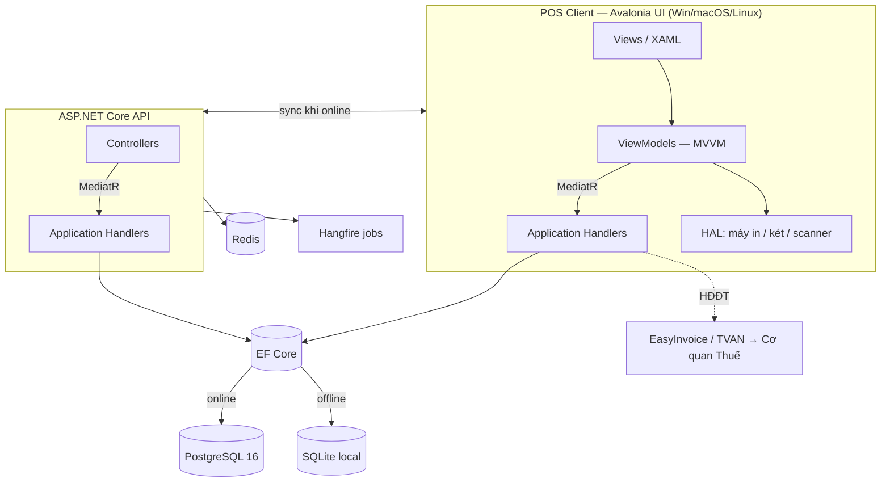
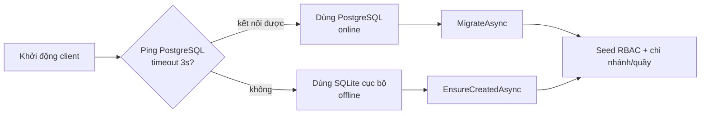
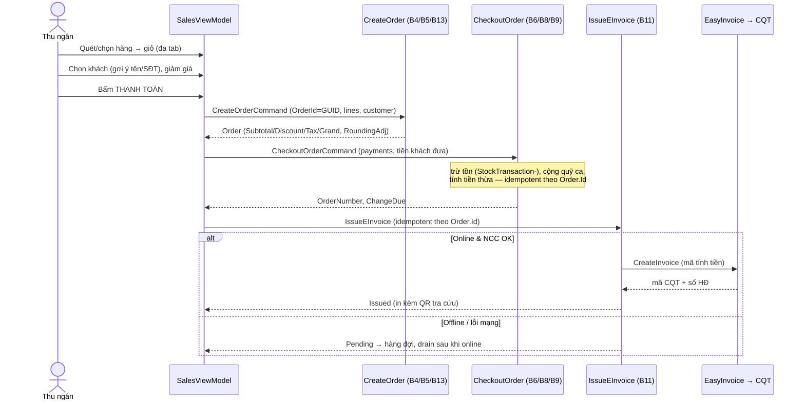
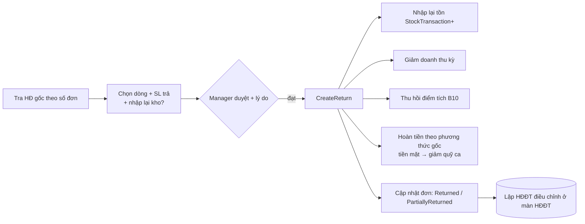
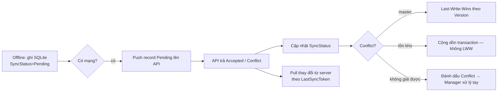

# Sales Management Software (POS)

Phần mềm **POS bán lẻ đa nền tảng** (Windows / macOS / Linux), chạy **offline-first**, đồng bộ khi có mạng. Thị trường **Việt Nam** — hỗ trợ **hóa đơn điện tử khởi tạo từ máy tính tiền kết nối thuế** (EasyInvoice / SoftDreams). Triển khai thực tế đầu tiên: chuỗi **Eggs Kids Clothing**.

> Stack: .NET 8 · Avalonia UI 11 · ASP.NET Core 8 · EF Core 8 · PostgreSQL 16 · SQLite · SignalR · Hangfire · MediatR (CQRS).

---

## 1. Tổng quan

Một codebase duy nhất build ra app native cho 3 OS. Client Avalonia (MVVM) **nối thẳng PostgreSQL khi online, tự rơi về SQLite khi offline**, gọi nghiệp vụ qua **MediatR handlers** dùng chung với API. Toàn bộ logic bán lẻ tuân thủ tài liệu nghiệp vụ `BusinessRules.md` (B1–B14) và quy ước kỹ thuật `Technical.md`.

**Nguyên tắc cốt lõi (vi phạm = bug nghiêm trọng):**
- Khóa chính = **GUID sinh ở client** cho mọi bảng giao dịch (an toàn khi sync offline).
- Tiền tệ dùng **`decimal`**, làm tròn ở bước cuối (B13).
- Tồn kho = **cộng dồn `StockTransaction` (append-only)**, không update 1 dòng tồn.
- **Idempotency-Key** = `Order.Id` trên mọi lệnh tạo đơn / thanh toán / phát hành HĐĐT.
- Phần cứng qua **HAL** (interface), nạp theo OS runtime. MVVM: View không chứa logic nghiệp vụ.

### Tài liệu

| File | Nội dung |
|---|---|
| [`CLAUDE.md`](./CLAUDE.md) | Ngữ cảnh & quy ước BẮT BUỘC cho AI/dev + bảng màn hình |
| [`docs/Technical.md`](./docs/Technical.md) | Kiến trúc, build/đóng gói đa nền tảng, sync, phần cứng, CI/CD, bảo mật |
| [`docs/BusinessRules.md`](./docs/BusinessRules.md) | Nghiệp vụ bán lẻ (B1–B14) + ERD + tích hợp HĐĐT |
| [`docs/Remember.md`](./docs/Remember.md) | Nhật ký cài đặt & môi trường |

---

## 2. Kiến trúc



Tầng (Clean Architecture): `Pos.Domain` (entity thuần) → `Pos.Application` (CQRS/MediatR handlers, dùng chung client+API) → `Pos.Infrastructure` (EF Core, migration, EasyInvoice adapter) → `Pos.Client.UI` / `Pos.Api` (giao diện). Phần cứng tách `Pos.Hardware.*`.

### Chọn nguồn dữ liệu (offline-first)



---

## 3. Cấu trúc dự án

```
src/
├── Pos.Domain/               # Entity + enum thuần (Sales, Inventory, Customers, Invoicing, Operations…)
├── Pos.Application/          # CQRS handlers (MediatR): Orders, Inventory, Shifts, Returns, Customers,
│                             #   Invoicing, Pricing, Reports, Auth — dùng CHUNG cho client & API
├── Pos.Infrastructure/       # PosDbContext, migrations, DbSeeder, EasyInvoice adapter
├── Pos.Client.UI/            # Avalonia Views + ViewModels + design system (App.axaml) + Assets/logo
├── Pos.Client.Core/          # (dự phòng) VM/service chia sẻ — hiện trống
├── Pos.Hardware.Abstractions/# IReceiptPrinter, ICashDrawer, IBarcodeScanner
├── Pos.Hardware.MacOS/       # In ESC/POS qua TCP 9100, mở két, render hóa đơn
├── Pos.Hardware.Windows/     # (chưa hiện thực)
├── Pos.Api/                  # ASP.NET Core controllers (Orders/Inventory/Returns/Shifts)
└── Pos.Sync/                 # (chưa hiện thực) engine đồng bộ offline-first
tests/                        # xUnit: Domain / Application / Infrastructure / Sync
deploy/                       # docker-compose (PostgreSQL + Redis), api.Dockerfile
build/                        # build-windows.ps1 / build-macos.sh / build-linux.sh
```

---

## 4. Màn hình & điều hướng

Vỏ `MainWindowViewModel` có **cổng đăng nhập**: chưa xác thực chỉ hiện màn cổng; đăng nhập xong mới mở ca (B9) và hiện khu làm việc. Nav theo **quyền (RBAC)**.

```mermaid
stateDiagram-v2
    [*] --> Cổng
    state Cổng {
        [*] --> KiểmTra
        KiểmTra --> ThiếtLập: chưa có tài khoản
        KiểmTra --> ĐăngNhập: đã có tài khoản
        ThiếtLập --> Authenticated: tạo Owner
        ĐăngNhập --> Authenticated: đúng mật khẩu
    }
    Authenticated --> MởCa: ca đang mở? nếu chưa → OpenShift
    MởCa --> BánHàng

    state KhuLàmViệc {
        BánHàng --> TrảHàng: quyền return.refund
        BánHàng --> CaQuỹ
        BánHàng --> KháchHàng
        BánHàng --> QuảnTrị: quyền admin
        state QuảnTrị {
            SảnPhẩm --> NhậpHàng --> TồnKho
        }
        BánHàng --> HĐĐT: quyền report.view
        BánHàng --> BáoCáo: quyền report.view
        BánHàng --> NgườiDùng: quyền user.manage
    }
    KhuLàmViệc --> ĐăngNhập: Đăng xuất
```

| Màn hình | `CurrentKey` | Quyền (gate) | Nghiệp vụ |
|---|---|---|---|
| AccountSetup / Login | `setup`/`login` | — | B2 |
| Bán hàng (POS) | `pos` | đã đăng nhập | B4/B5/B6/B8/B9/B13 |
| Trả / Đổi hàng | `returns` | `return.refund` | B7 |
| Ca & Quỹ tiền | `shift` | đã đăng nhập | B9 |
| Khách hàng & Công nợ | `customers` | đã đăng nhập | B10 |
| Sản phẩm | `products` | admin | B3/B8 |
| Nhập hàng | `receive` | admin | B8 |
| Tồn kho | `inventory` | admin | B8 |
| Hóa đơn điện tử | `invoices` | `report.view` | B11 |
| Báo cáo | `reports` | `report.view` | B12 |
| Người dùng & phân quyền | `users` | `user.manage` | B2 |

---

## 5. Luồng bán hàng → thanh toán → HĐĐT (end-to-end)



> Thứ tự tính tiền (B5/B13): giá → CK dòng → CK tổng phân bổ → thuế theo từng thuế suất → làm tròn. Thanh toán hỗn hợp được handler hỗ trợ (`Payments[]`, SUM = GrandTotal).

### Trả hàng / hoàn tiền (B7)



### Đồng bộ offline-first (thiết kế — `Pos.Sync` chưa hiện thực)



---

## 6. Trạng thái hiện thực (B1–B14)

| Module | Trạng thái | Ghi chú |
|---|---|---|
| B2 Tổ chức & RBAC | ☑ | 5 role + quyền theo hành động · ☐ AuditLog · ☐ Manager PIN |
| B3 Sản phẩm | ◐ | CRUD cơ bản + tồn ban đầu · ☐ đa biến thể/nhiều barcode/quy đổi ĐV/bảng giá/bán cân |
| B4 Bán hàng | ☑ | Giỏ đa tab, hold/resume, void, checkout |
| B5 Giá & KM | ◐ | Engine %/số tiền/bậc SL/voucher/hạng · ☐ BOGO/Combo · ☐ UI quản lý KM + ô voucher ở POS |
| B6 Thanh toán | ◐ | Handler hỗ trợ hỗn hợp · ☐ UI nhiều phương thức · ☐ VietQR động · ☐ máy thẻ/ví |
| B7 Trả hàng | ◐ | Trả 1 phần/toàn phần + hoàn + thu hồi điểm · ☐ đổi hàng · ☐ tự sinh HĐĐT điều chỉnh |
| B8 Tồn kho | ◐ | Append-only, nhập (GRN), điều chỉnh, chuyển kho (handler), giá vốn bình quân · ☐ UI kiểm kê/chuyển kho · ☐ cảnh báo tồn/FIFO |
| B9 Ca & Quỹ | ☑ | Mở/đóng ca, thu/chi, X/Z-report, Variance |
| B10 Khách & Công nợ | ◐ | Hồ sơ, điểm, công nợ, thu nợ, gợi ý ở POS · ☐ hạng thành viên/ví trả trước |
| B11 HĐĐT | ◐ | Adapter EasyInvoice + phát hành/điều chỉnh/hủy/hàng đợi · ☐ endpoint thật (đang MẪU) · ☐ job nền drain (Hangfire) · ☐ lưu PDF/XML+QR |
| B12 Báo cáo | ◐ | 6 báo cáo (bán hàng/lợi nhuận/đối soát/thuế/tồn/tuổi nợ) · ☐ chạy offline (SQLite không SUM decimal) · ☐ cache Redis |
| B13 Tiền tệ | ☑ | `decimal`, làm tròn VND, thuế cộng dồn theo thuế suất |
| **Sync** (Tech §9) | ☐ | `Pos.Sync` rỗng — chưa có push/pull/conflict |
| **HAL in/két/scanner** | ◐ | Driver mạng macOS có · ☐ chưa gắn vào checkout · ☐ Windows/Linux/scanner |
| **Bảo mật** (Tech §17) | ◐ | RBAC + băm mật khẩu PBKDF2 · ☐ JWT/ISecureStorage/SQLCipher |
| **Auto-update** (Tech §13) | ☐ | Chưa có (Velopack) |

☑ xong · ◐ một phần · ☐ chưa làm

---

## 7. Getting Started

```bash
# 1. Hạ tầng local (PostgreSQL :5433 + Redis :6379)
cd deploy && docker compose up -d && cd ..

# 2. Restore & build
dotnet restore && dotnet build

# 3. Chạy
dotnet run --project src/Pos.Api          # API  → Swagger https://localhost:5001/swagger
dotnet run --project src/Pos.Client.UI    # POS client (Avalonia)

# 4. Test
dotnet test
```

Lần đầu chạy client (chưa có tài khoản) → màn **Thiết lập** tạo tài khoản Owner. Không có Postgres → client tự dùng SQLite offline.

**Yêu cầu:** .NET SDK 8.0 · Docker Desktop · (tạo project mới) `dotnet new install Avalonia.Templates`. Máy dev hiện tại: Intel Mac → publish macOS dùng RID `osx-x64` (xem `docs/Remember.md`).

---

## 8. Bảo mật & Git

- **KHÔNG commit secret** — dùng User Secrets / biến môi trường (DB, JWT, EasyInvoice). Cấu hình chi nhánh/HĐĐT qua biến `POS_*`.
- Branch: `main` (release) · `develop` · `feature/*` · `hotfix/*`. Commit theo **Conventional Commits** (`feat:`, `fix:`, `refactor:`, `docs:`, `test:`).
