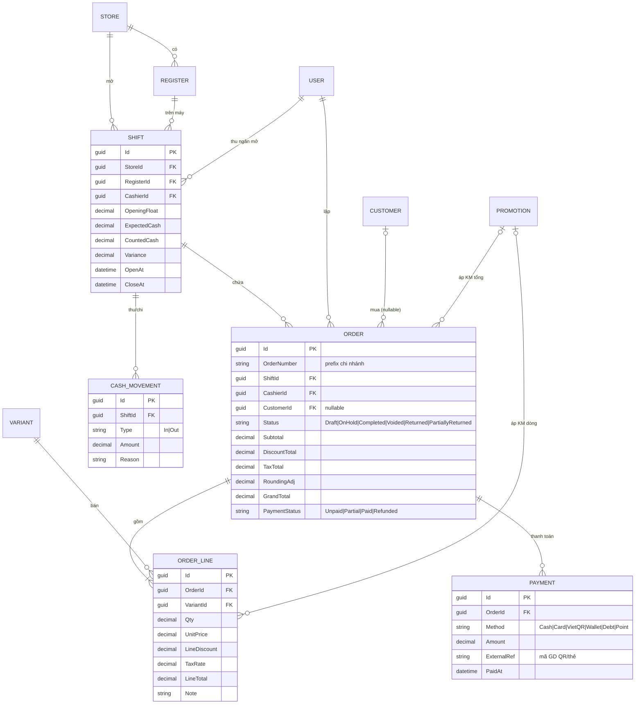
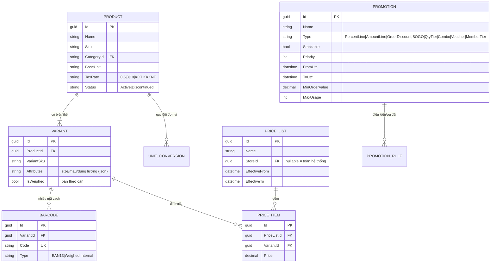
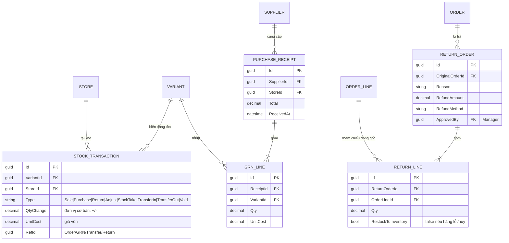
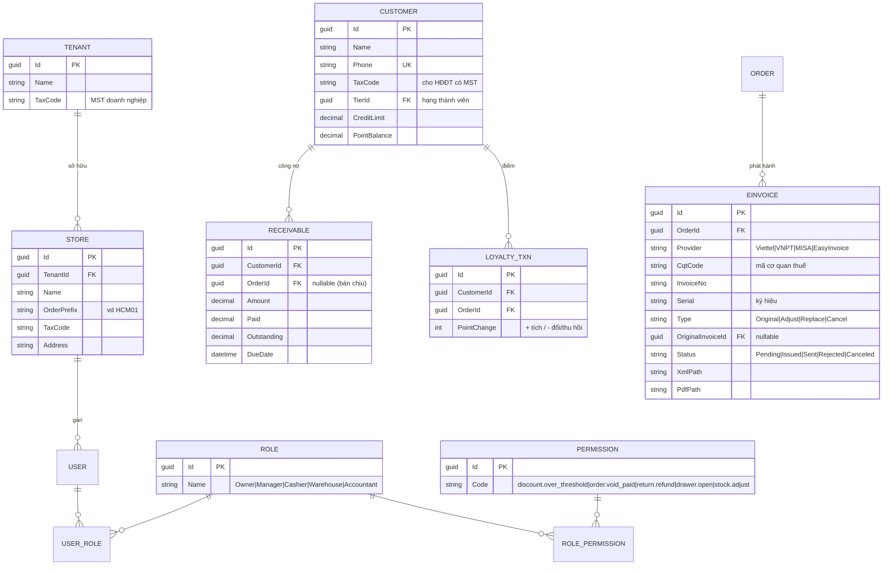

# BusinessRules.md — Nghiệp vụ & Domain (Bán lẻ - Việt Nam)

> Tài liệu **nghiệp vụ (business domain)** cho phần mềm Quản lý Bán hàng (POS): mô tả **phần mềm làm được gì cho cửa hàng bán lẻ** — entity, luồng nghiệp vụ, business rule, edge case cần test.
> Tài liệu kỹ thuật (kiến trúc, build, đa nền tảng, sync, phần cứng) xem ở [`Technical.md`](./Technical.md).
>
> Trọng tâm: **cửa hàng bán lẻ** (tạp hóa, thời trang, mỹ phẩm, điện thoại–phụ kiện, siêu thị mini, chuỗi cửa hàng), vận hành **tại Việt Nam**, **bắt buộc hóa đơn điện tử khởi tạo từ máy tính tiền kết nối dữ liệu với cơ quan thuế**.
>
> Quy ước đọc: mỗi chương gồm **Entity chính → Use case/Luồng → Business rule → Edge case test**.

---

## Mục lục

- B1. [Tổng quan nghiệp vụ & phạm vi](#b1-tổng-quan-nghiệp-vụ--phạm-vi)
- B2. [Mô hình tổ chức & phân quyền (Multi-store / RBAC)](#b2-mô-hình-tổ-chức--phân-quyền-multi-store--rbac)
- B3. [Danh mục sản phẩm (Product / Catalog)](#b3-danh-mục-sản-phẩm-product--catalog)
- B4. [Bán hàng & Hóa đơn (Sales / Order)](#b4-bán-hàng--hóa-đơn-sales--order)
- B5. [Giá, Chiết khấu & Khuyến mãi (Pricing / Promotion)](#b5-giá-chiết-khấu--khuyến-mãi-pricing--promotion)
- B6. [Thanh toán (Payment)](#b6-thanh-toán-payment)
- B7. [Trả hàng / Đổi hàng / Hoàn tiền (Return / Refund)](#b7-trả-hàng--đổi-hàng--hoàn-tiền-return--refund)
- B8. [Tồn kho & Kho (Inventory)](#b8-tồn-kho--kho-inventory)
- B9. [Ca làm việc & Quỹ tiền (Shift / Cash Management)](#b9-ca-làm-việc--quỹ-tiền-shift--cash-management)
- B10. [Khách hàng, Công nợ & Tích điểm (CRM / Loyalty)](#b10-khách-hàng-công-nợ--tích-điểm-crm--loyalty)
- B11. [Hóa đơn điện tử & Máy tính tiền kết nối thuế (VN)](#b11-hóa-đơn-điện-tử--máy-tính-tiền-kết-nối-thuế-vn)
  - B11-A. [Tích hợp EasyInvoice (SoftDreams) — chi tiết](#b11-a-tích-hợp-easyinvoice-softdreams--chi-tiết)
- B12. [Báo cáo (Reports)](#b12-báo-cáo-reports)
- B13. [Quy tắc tiền tệ, làm tròn & thứ tự tính toán](#b13-quy-tắc-tiền-tệ-làm-tròn--thứ-tự-tính-toán)
- B14. [ERD / Sơ đồ entity & quan hệ](#b14-erd--sơ-đồ-entity--quan-hệ)
- [Checklist triển khai (Implementation Tracker)](#checklist-triển-khai-implementation-tracker)

---

## Checklist triển khai (Implementation Tracker)

> Bảng theo dõi tiến độ triển khai nghiệp vụ. **Ưu tiên:** `P0` = bắt buộc v1 / phát hành được; `P1` = quan trọng, sớm sau v1; `P2` = mở rộng v2.
> **Trạng thái:** ☐ Chưa làm · ◐ Đang làm · ☑ Xong. Cập nhật trực tiếp ô trạng thái khi triển khai.

### B2 — Tổ chức & Phân quyền
| ☐ | Hạng mục | Ưu tiên |
|---|---|---|
| ☐ | Mô hình Tenant → Store → Register/Device → User | P0 |
| ☐ | RBAC: 5 role (Owner/Manager/Cashier/Warehouse/Accountant) | P0 |
| ☐ | Quyền theo hành động + xác thực Manager PIN | P0 |
| ☐ | AuditLog cho thao tác nhạy cảm | P0 |
| ☐ | Master data dùng chung vs ghi đè theo chi nhánh | P1 |

### B3 — Danh mục sản phẩm
| ☐ | Hạng mục | Ưu tiên |
|---|---|---|
| ☐ | Product + Variant (SKU) | P0 |
| ☐ | Nhiều barcode / 1 variant | P0 |
| ☐ | Thuế suất VAT cấp sản phẩm | P0 |
| ☐ | Quy đổi đơn vị (thùng/lốc/lẻ) | P1 |
| ☐ | Bảng giá theo chi nhánh/thời điểm | P1 |
| ☐ | Bán theo cân + mã cân điện tử | P1 |
| ☐ | Quản lý lô/hạn dùng | P2 |

### B4 — Bán hàng & Hóa đơn
| ☐ | Hạng mục | Ưu tiên |
|---|---|---|
| ☐ | Giỏ hàng + quét barcode/tìm SP | P0 |
| ☐ | State machine đơn (Draft→Completed→Returned/Voided) | P0 |
| ☐ | Checkout + in hóa đơn | P0 |
| ☐ | OrderNumber prefix chi nhánh + GUID nội bộ | P0 |
| ☐ | Giữ đơn (Hold/Park/Resume) | P1 |
| ☐ | In tạm tính / in lại | P1 |

### B5 — Giá, Chiết khấu & Khuyến mãi
| ☐ | Hạng mục | Ưu tiên |
|---|---|---|
| ☐ | Chiết khấu dòng / tổng đơn | P0 |
| ☐ | Thứ tự tính giá→CK→thuế→làm tròn | P0 |
| ☐ | Voucher/Coupon (hạn dùng, điều kiện tối thiểu) | P1 |
| ☐ | BOGO / bậc số lượng / combo | P1 |
| ☐ | Giờ vàng / đồng giá / giảm theo hạng | P2 |

### B6 — Thanh toán
| ☐ | Hạng mục | Ưu tiên |
|---|---|---|
| ☐ | Tiền mặt + tính tiền thối + làm tròn | P0 |
| ☐ | Thanh toán hỗn hợp (nhiều phương thức/đơn) | P0 |
| ☐ | VietQR động + xác nhận đã nhận tiền | P0 |
| ☐ | Thẻ (POS terminal) | P1 |
| ☐ | Ví điện tử (MoMo/ZaloPay/VNPay) | P1 |
| ☐ | Trừ tiền bằng điểm/voucher | P2 |

### B7 — Trả/Đổi/Hoàn tiền
| ☐ | Hạng mục | Ưu tiên |
|---|---|---|
| ☐ | Trả một phần/toàn phần tham chiếu HĐ gốc | P0 |
| ☐ | Nhập lại tồn + giảm doanh thu + thu hồi điểm | P0 |
| ☐ | Sinh HĐĐT điều chỉnh/thay thế | P0 |
| ☐ | Đổi hàng + bù/hoàn chênh lệch | P1 |

### B8 — Tồn kho
| ☐ | Hạng mục | Ưu tiên |
|---|---|---|
| ☐ | StockTransaction append-only (tồn = cộng dồn) | P0 |
| ☐ | Nhập hàng (GRN) + giá vốn | P0 |
| ☐ | Tồn theo từng chi nhánh | P0 |
| ☐ | Kiểm kê + điều chỉnh | P1 |
| ☐ | Giá vốn FIFO/bình quân → lãi gộp | P1 |
| ☐ | Chuyển kho giữa chi nhánh | P1 |
| ☐ | Cảnh báo tồn tối thiểu/hết hạn | P2 |

### B9 — Ca & Quỹ tiền
| ☐ | Hạng mục | Ưu tiên |
|---|---|---|
| ☐ | Mở/đóng ca + đếm quỹ + Variance | P0 |
| ☐ | Thu/chi tiền mặt trong ca | P0 |
| ☐ | X-report / Z-report | P1 |

### B10 — Khách hàng & Loyalty
| ☐ | Hạng mục | Ưu tiên |
|---|---|---|
| ☐ | Hồ sơ KH (SĐT, MST cho HĐĐT) | P0 |
| ☐ | Công nợ/bán chịu + hạn mức | P1 |
| ☐ | Tích điểm/hạng thành viên + thu hồi khi trả | P1 |
| ☐ | Ví trả trước | P2 |

### B11 — HĐĐT & Máy tính tiền kết nối thuế ⚠️ pháp lý
| ☐ | Hạng mục | Ưu tiên |
|---|---|---|
| ☐ | Chốt nhà cung cấp HĐĐT (TVAN) | **P0** |
| ☐ | Interface `IEInvoiceProvider` + adapter | **P0** |
| ☐ | Phát hành lấy mã CQT + lưu XML/PDF | **P0** |
| ☐ | Hàng đợi offline → phát hành khi online (idempotent) | **P0** |
| ☐ | Hóa đơn điều chỉnh/thay thế/hủy | **P0** |
| ☐ | Map thuế suất + QR tra cứu trên hóa đơn in | **P0** |

### B12 — Báo cáo
| ☐ | Hạng mục | Ưu tiên |
|---|---|---|
| ☐ | Doanh thu theo ngày/ca/thu ngân/chi nhánh | P0 |
| ☐ | Sổ quỹ + đối soát theo phương thức TT | P0 |
| ☐ | Bảng kê HĐĐT + tổng thuế theo thuế suất | P0 |
| ☐ | Lãi gộp / bán chạy–chậm / tồn kho | P1 |
| ☐ | Công nợ phải thu/phải trả | P1 |

### B13 — Tiền tệ & Làm tròn
| ☐ | Hạng mục | Ưu tiên |
|---|---|---|
| ☐ | Dùng `decimal` toàn hệ thống | P0 |
| ☐ | Quy tắc làm tròn VND + RoundingAdj | P0 |
| ☐ | Thuế cộng dồn theo từng thuế suất | P0 |
| ☐ | Phân bổ chiết khấu tổng khử dư 1đ | P0 |

---

## B1. Tổng quan nghiệp vụ & phạm vi

### Đối tượng sử dụng

| Vai trò | Công việc chính |
|---|---|
| Chủ/Quản lý (Owner/Manager) | Cấu hình hệ thống, duyệt thao tác nhạy cảm, xem báo cáo, quản lý kho/giá/KM |
| Thu ngân (Cashier) | Bán hàng, thu tiền, in hóa đơn, mở/đóng ca |
| Thủ kho (Warehouse) | Nhập hàng, kiểm kê, chuyển kho |
| Kế toán (Accountant) | Đối soát doanh thu/quỹ, công nợ, hóa đơn điện tử, thuế |

### Quy trình bán lẻ tổng quát (happy path)

```
Mở ca (đếm quỹ đầu ca)
   → Quét mã / chọn sản phẩm → Giỏ hàng
   → Áp giá + chiết khấu/KM + thuế
   → Thanh toán (tiền mặt / thẻ / QR / hỗn hợp)
   → Phát hành HĐĐT (mã CQT) + in hóa đơn (kèm QR tra cứu)
   → Trừ tồn kho
   → ... (lặp lại nhiều đơn) ...
   → Đóng ca (đếm quỹ cuối ca, đối soát X/Z report)
```

### Phạm vi (in/out scope) — chốt sớm để tránh phình

- **In scope (v1):** bán tại quầy, đa phương thức thanh toán, tồn kho cơ bản, ca/quỹ, khách hàng & công nợ, HĐĐT máy tính tiền, báo cáo cốt lõi, đa chi nhánh.
- **Out scope (cân nhắc v2):** sàn TMĐT/đồng bộ Shopee–Lazada, giao hàng (delivery/shipper), kế toán đầy đủ (sổ cái), sản xuất/định mức NVL, đặt hàng online.

---

## B2. Mô hình tổ chức & phân quyền (Multi-store / RBAC)

### Entity chính

```
Tenant (Doanh nghiệp/Chủ)
 └── Store/Branch (Chi nhánh)        ← prefix mã đơn riêng (vd HCM01), MST, địa chỉ
      └── Register/Device (Máy POS)   ← DeviceId, gắn với máy in, két
      └── User (Nhân viên)            ← thuộc 1 hoặc nhiều chi nhánh, có Role
Role (Owner/Manager/Cashier/Warehouse/Accountant)
Permission (quyền theo hành động)
```

### Business rule

- Dữ liệu **master** (sản phẩm, giá, KM) có thể **dùng chung toàn hệ thống** hoặc **ghi đè theo chi nhánh** (giá/KM theo chi nhánh).
- Dữ liệu **giao dịch** (đơn, tồn, quỹ) **luôn gắn `StoreId` + `DeviceId`**.
- Người dùng chỉ thấy dữ liệu chi nhánh mình được gán; Owner thấy toàn bộ.

### Phân quyền theo hành động (không chỉ theo màn hình) — map quyền nghiệp vụ

| Hành động nhạy cảm | Mặc định cần | Ghi chú |
|---|---|---|
| Giảm giá thủ công vượt ngưỡng (vd > 10%) | Manager PIN | Ngưỡng cấu hình được |
| Hủy/sửa đơn **đã thanh toán** | Manager PIN | Ghi AuditLog |
| Trả hàng / hoàn tiền | Manager PIN | |
| Sửa giá bán tại quầy | Manager PIN | |
| Mở két không gắn giao dịch | Manager PIN | |
| Đóng ca có lệch quỹ vượt ngưỡng | Manager duyệt | |
| Xóa/điều chỉnh tồn kho | Warehouse + Manager | |

> **Edge case test:** thu ngân không có quyền giảm giá > ngưỡng → bị chặn, có log; Manager nhập PIN → cho qua + ghi ai duyệt.

---

## B3. Danh mục sản phẩm (Product / Catalog)

### Entity chính

- **Product**: tên, mã nội bộ (SKU), ngành hàng/nhóm, đơn vị cơ bản, thuế suất VAT, trạng thái (bán/ngừng).
- **Variant** (biến thể): theo thuộc tính (size, màu, dung lượng…) → mỗi biến thể 1 SKU + 1 hoặc nhiều **Barcode**.
- **Barcode**: 1 sản phẩm có thể có **nhiều mã vạch**; hỗ trợ **mã cân điện tử** (barcode chứa khối lượng/giá).
- **UnitConversion**: quy đổi đơn vị (Thùng = 24 Lon), bán & tồn theo đơn vị cơ bản.
- **PriceList** (bảng giá): giá theo bảng giá / chi nhánh / thời điểm.
- **Lot/Expiry** (tùy chọn): lô + hạn dùng (mỹ phẩm, thực phẩm).

### Business rule

- **SKU/Barcode là duy nhất**; quét trùng barcode phải ra đúng 1 biến thể.
- Sản phẩm **bán theo cân** (kg/gram): giá = đơn giá × khối lượng, làm tròn theo B13.
- Giá có thể âm? **Không** — chặn. Giá = 0 chỉ khi là quà tặng/khuyến mãi có đánh dấu.
- Sản phẩm **ngừng bán** không hiển thị ở quầy nhưng vẫn tra cứu được trong lịch sử.
- **Thuế suất VAT** gắn ở cấp sản phẩm (0% / 5% / 8% / 10% / không chịu thuế / KCT) — phục vụ HĐĐT.

### Edge case test

- Quét mã cân điện tử → tách đúng mã SP + khối lượng + giá.
- Bán theo thùng nhưng tồn lẻ theo lon → quy đổi & trừ tồn đúng.
- Đổi giá ở bảng giá chi nhánh không ảnh hưởng chi nhánh khác.

---

## B4. Bán hàng & Hóa đơn (Sales / Order)

### Entity chính

```
Order (Đơn/Hóa đơn bán)
 ├── Id (GUID, sinh ở client)        ├── StoreId, DeviceId, ShiftId, CashierId
 ├── OrderNumber (prefix chi nhánh)  ├── CustomerId (nullable - khách lẻ)
 ├── Status                          ├── Subtotal, DiscountTotal, TaxTotal, GrandTotal, RoundingAdj
 ├── OrderLines[]                     └── Payments[]
OrderLine: ProductId/VariantId, Qty, UnitPrice, LineDiscount, TaxRate, LineTotal, Note
```

### Trạng thái đơn (state machine)

```
Draft (giỏ hàng) ──hold──► OnHold
   │ checkout                  │ resume
   ▼                           ▼
Completed ──refund/return──► Returned (toàn phần) / PartiallyReturned
   └── Voided (hủy trước khi hoàn tất — cần quyền)
```

### Use case / Luồng chính

1. **Tạo giỏ** → thêm dòng (quét barcode / tìm tên / chọn nhanh / phím tắt).
2. Sửa số lượng, xóa dòng, ghi chú dòng.
3. **Giữ đơn (Hold/Park)**: lưu giỏ đang phục vụ để mở đơn khác, sau đó **resume**.
4. Áp khách hàng (tích điểm/công nợ), áp KM/voucher.
5. **Checkout** → chọn thanh toán → phát hành HĐĐT → in.
6. **In tạm tính** (chưa chốt) và **in lại** hóa đơn đã hoàn tất.

### Business rule

- **OrderNumber** hiển thị có prefix chi nhánh (vd `HCM01-000123`); nội bộ định danh bằng **GUID**. Số chính thức có thể cấp khi phát hành HĐĐT.
- Đơn rỗng (0 dòng / tổng tiền 0) **không cho** checkout (trừ trường hợp quà tặng có đánh dấu).
- **Hủy đơn đã thanh toán/đã phát hành HĐĐT**: không xóa cứng — phải qua nghiệp vụ **điều chỉnh/thay thế/hủy hóa đơn** (xem B11) + AuditLog.
- Mỗi đơn phải gắn **1 ca (Shift) đang mở**; không có ca mở → chặn bán (hoặc bắt mở ca).
- Bán **âm kho**: cấu hình cho phép/không (mặc định **cảnh báo + cần quyền** nếu vượt tồn).

### Edge case test

- Giữ 3 đơn cùng lúc, resume đúng đơn, không lẫn dòng/khách.
- Mất điện giữa checkout → mở lại app, đơn ở trạng thái nhất quán (không trừ tồn 2 lần — idempotency).
- Hai thu ngân 2 máy bán cùng sản phẩm tồn thấp → tồn không âm sai sau sync.

---

## B5. Giá, Chiết khấu & Khuyến mãi (Pricing / Promotion)

### Loại khuyến mãi cần hỗ trợ (retail)

| Loại | Ví dụ |
|---|---|
| Giảm % / số tiền trên dòng | -10% / -5.000đ cho 1 SP |
| Giảm % / số tiền trên tổng đơn | đơn từ 500k giảm 50k |
| Mua X tặng Y (BOGO) | mua 2 tặng 1 |
| Giảm theo bậc số lượng | mua ≥ 5 giá còn… |
| Combo / mua kèm giá ưu đãi | SP A + B = giá gộp |
| Đồng giá / giờ vàng | 19:00–21:00 đồng giá |
| Voucher / Coupon / mã giảm giá | nhập mã, có hạn dùng & điều kiện tối thiểu |
| Giảm theo hạng thành viên | VIP -5% |

### Business rule

- **Thứ tự áp dụng & gộp KM** phải định nghĩa rõ: ưu tiên (priority), **cho phép cộng dồn hay loại trừ** (stackable / exclusive).
- Điều kiện áp dụng: thời gian, chi nhánh, nhóm SP, hạng KH, giá trị đơn tối thiểu, số lần dùng tối đa (theo voucher/theo KH).
- **Chiết khấu thủ công** của thu ngân: giới hạn ngưỡng + cần quyền (B2).
- KM không được làm **tổng tiền < 0**; quà tặng (giá 0) phải vẫn ghi nhận xuất kho.

### Thứ tự tính toán (BẮT BUỘC định nghĩa — tránh lệch tiền)

```
1) Đơn giá gốc theo bảng giá (theo chi nhánh/thời điểm)
2) Chiết khấu dòng (line discount / KM theo dòng)
3) Chiết khấu/KM trên tổng đơn (phân bổ về dòng để tính thuế)
4) Tính thuế VAT theo từng dòng (theo thuế suất của SP)
5) Làm tròn tổng (xem B13)
```

### Edge case test

- 1 SP vừa KM theo dòng vừa thuộc KM tổng đơn → không nhân đôi giảm.
- Voucher hết lượt / hết hạn / chưa đạt giá trị tối thiểu → từ chối đúng.
- Phân bổ chiết khấu tổng về các dòng sao cho tổng VAT khớp tới đồng.

---

## B6. Thanh toán (Payment)

### Phương thức (Việt Nam)

- **Tiền mặt** (cash): nhập tiền khách đưa → **tính tiền thối**, làm tròn tiền lẻ.
- **Thẻ** (card/POS terminal): qua máy thanh toán thẻ (xem phần phần cứng trong `Technical.md`).
- **QR động VietQR / chuyển khoản ngân hàng** (sinh QR theo số tiền + nội dung = mã đơn).
- **Ví điện tử**: MoMo, ZaloPay, VNPay-QR (qua cổng/đối tác).
- **Công nợ (ghi nợ KH)** — bán chịu (xem B10).
- **Điểm thưởng / voucher trừ tiền**.

### Business rule

- **Thanh toán hỗn hợp**: 1 đơn nhiều phương thức (vd tiền mặt 100k + QR phần còn lại). Tổng các payment = GrandTotal.
- Mỗi payment ghi: phương thức, số tiền, tham chiếu (mã giao dịch QR/thẻ), thời điểm.
- Trạng thái thanh toán đơn: **Unpaid / Partial / Paid / Refunded**.
- **QR**: cần cơ chế xác nhận đã nhận tiền (webhook ngân hàng/đối soát hoặc xác nhận tay) — quy định rõ khi nào coi là "Paid".
- **Mở két tiền** chỉ tự động khi có payment tiền mặt; mở thủ công cần quyền (B2).

### Edge case test

- Khách đưa dư → tiền thối đúng; tiền mặt làm tròn theo B13.
- QR thanh toán nhưng tiền chưa về → đơn không tự "Paid" (tránh thất thoát).
- Hỗn hợp lệch 1đ do làm tròn → khử chênh đúng dòng.

---

## B7. Trả hàng / Đổi hàng / Hoàn tiền (Return / Refund)

> Nghiệp vụ phức tạp nhất về dữ liệu — phải đúng cả tồn kho, doanh thu **và hóa đơn điện tử**.

### Use case

- **Trả toàn phần / một phần**: chọn hóa đơn gốc → chọn dòng & số lượng trả.
- **Đổi hàng**: trả SP A, mua SP B, bù/hoàn chênh lệch.
- **Hoàn tiền**: theo phương thức gốc (tiền mặt/chuyển khoản); ghi nhận lý do.

### Business rule

- Trả hàng phải **tham chiếu hóa đơn gốc** (OriginalOrderId); không cho trả quá số lượng đã mua.
- **Nhập lại tồn kho** SP trả (trừ trường hợp hàng lỗi/hủy — đánh dấu riêng).
- **Giảm doanh thu** kỳ tương ứng; tính lại điểm thưởng/công nợ đã phát sinh.
- **HĐĐT:** phát hành **hóa đơn điều chỉnh/thay thế** hoặc **hóa đơn trả hàng** theo quy định (xem B11) — không sửa ngầm hóa đơn cũ.
- Cần **quyền Manager** + lý do + AuditLog.

### Edge case test

- Trả 1 phần của đơn có KM tổng đơn → hoàn đúng tỷ lệ chiết khấu & thuế.
- Đổi hàng chênh lệch dương/âm → thu thêm / hoàn lại đúng.
- Trả hàng sau khi đã phát hành HĐĐT → sinh chứng từ điều chỉnh hợp lệ.

---

## B8. Tồn kho & Kho (Inventory)

### Entity & nghiệp vụ

- **StockTransaction (append-only)**: mọi biến động tồn là 1 bản ghi (bán -, nhập +, trả +, hủy -, kiểm kê ±, chuyển kho ±). Tồn = cộng dồn (đồng bộ với cơ chế sync offline-first ở `Technical.md`).
- **Nhập hàng (GRN/Purchase Receipt)**: từ nhà cung cấp, có **giá vốn**; cập nhật tồn +.
- **Kiểm kê (Stock-take)**: đếm thực tế → sinh điều chỉnh chênh lệch (hao hụt/thừa).
- **Chuyển kho (Transfer)**: giữa các chi nhánh — xuất kho A, nhập kho B (2 vế khớp).
- **Giá vốn & lợi nhuận**: phương pháp **bình quân gia quyền** hoặc **FIFO** (chốt 1 cách, ghi rõ) → tính lãi gộp.
- **Cảnh báo tồn**: tồn tối thiểu (reorder point), gần hết, **hạn dùng** (nếu quản lý lô).

### Business rule

- Tồn theo **đơn vị cơ bản**; mọi giao dịch quy đổi về đơn vị cơ bản.
- Tồn theo **từng chi nhánh** (không gộp toàn hệ thống khi bán).
- Bán làm tồn về **âm**: theo cấu hình (chặn / cảnh báo + cần quyền).
- Giá vốn khi bán lấy theo phương pháp đã chọn tại thời điểm bán.

### Edge case test

- 2 máy offline cùng bán SP tồn 1 → sau sync phát hiện vượt tồn, cảnh báo Manager (không "ăn gian" tồn).
- Kiểm kê khi đang bán → chênh lệch tính đúng mốc thời gian.
- Chuyển kho thất bại 1 vế (mạng) → không để mất hàng giữa 2 kho (transaction/saga).

---

## B9. Ca làm việc & Quỹ tiền (Shift / Cash Management)

### Entity

- **Shift**: StoreId, DeviceId, CashierId, OpenAt/CloseAt, OpeningFloat (quỹ đầu), ExpectedCash, CountedCash, Variance (lệch).
- **CashMovement**: thu/chi tiền mặt ngoài bán hàng (nộp quỹ, chi vặt, rút bớt tiền).

### Use case / Business rule

- **Mở ca**: đếm & nhập quỹ đầu ca; mọi đơn gắn vào ca đang mở.
- **Trong ca**: ghi thu/chi tiền mặt có lý do.
- **Đóng ca**: đếm tiền cuối ca → so với **tiền mặt dự kiến** (đầu ca + bán tiền mặt − hoàn − chi + thu) → **Variance**.
- **X-report** (xem giữa ca, không đóng) / **Z-report** (chốt ca).
- Lệch quỹ vượt ngưỡng → cần Manager duyệt + ghi chú.

### Edge case test

- Đóng ca khi còn đơn Hold → cảnh báo/không cho tới khi xử lý.
- Tính ExpectedCash đúng khi có hoàn tiền mặt & chi vặt trong ca.

---

## B10. Khách hàng, Công nợ & Tích điểm (CRM / Loyalty)

### Entity

- **Customer**: tên, SĐT (định danh chính ở VN), địa chỉ, mã số thuế (cho HĐĐT có MST), nhóm/hạng.
- **Loyalty**: điểm tích lũy, hạng thành viên, quy tắc tích/đổi điểm.
- **Receivable (Công nợ)**: dư nợ, hạn mức tín dụng, lịch sử trả nợ (bán chịu).
- **Prepaid/Wallet** (tùy chọn): ví trả trước/nạp tiền.

### Business rule

- Khách lẻ (không định danh) vẫn bán bình thường (CustomerId null).
- **Bán chịu** chỉ khi KH có hồ sơ + còn hạn mức; vượt hạn mức cần quyền.
- Tích điểm theo doanh thu thực (sau chiết khấu, theo cấu hình có/không tính thuế).
- **Hoàn/trả hàng** phải **thu hồi điểm** đã cộng tương ứng.

### Edge case test

- Trả hàng đơn đã tích điểm → trừ lại điểm đúng, không âm điểm sai.
- Bán chịu vượt hạn mức → chặn hoặc cần Manager.

---

## B11. Hóa đơn điện tử & Máy tính tiền kết nối thuế (VN)

> **BẮT BUỘC** theo quy định Việt Nam: **Nghị định 123/2020/NĐ-CP**, **Thông tư 78/2021/TT-BTC**, và **Nghị định 70/2025/NĐ-CP** (sửa đổi 123) về **hóa đơn điện tử khởi tạo từ máy tính tiền có kết nối dữ liệu với cơ quan thuế (HĐĐT-MTT)**. Áp dụng cho hộ/doanh nghiệp bán lẻ trực tiếp tới người tiêu dùng (siêu thị, cửa hàng bán lẻ, F&B…).
>
> ⚠️ Đây là **yêu cầu tuân thủ pháp lý**, không phải tính năng "nice-to-have". Sai → khách bị phạt thuế. Cần thiết kế ngay từ đầu, không để v2.

### Mô hình tích hợp (khuyến nghị)

- **KHÔNG tự kết nối thẳng Tổng cục Thuế.** Tích hợp qua **nhà cung cấp dịch vụ HĐĐT (TVAN/Tổ chức cung cấp giải pháp)** đã được chấp nhận: **Viettel (S-Invoice/Viettel Invoice), VNPT Invoice, MISA meInvoice, EasyInvoice (SoftDreams), BKAV, M-Invoice…**
- Phần mềm POS tạo dữ liệu hóa đơn → gọi **API nhà cung cấp** → nhà cung cấp **cấp mã của cơ quan thuế (mã CQT)** → trả về để in/lưu/gửi KH.
- Thiết kế qua **interface trừu tượng `IEInvoiceProvider`** để **cắm/đổi nhà cung cấp** không sửa nghiệp vụ:

```csharp
public interface IEInvoiceProvider
{
    Task<EInvoiceResult> IssueAsync(EInvoiceRequest req, CancellationToken ct = default);   // phát hành, lấy mã CQT
    Task<EInvoiceResult> AdjustAsync(string originalKey, EInvoiceRequest req, CancellationToken ct = default); // điều chỉnh
    Task<EInvoiceResult> ReplaceAsync(string originalKey, EInvoiceRequest req, CancellationToken ct = default); // thay thế
    Task<EInvoiceResult> CancelAsync(string invoiceKey, string reason, CancellationToken ct = default);         // hủy
    Task<EInvoiceStatus> QueryAsync(string invoiceKey, CancellationToken ct = default);                          // tra cứu trạng thái
}
```

### Dữ liệu hóa đơn cần có (theo quy định)

- Thông tin **người bán**: tên, **MST**, địa chỉ, mã cơ quan thuế quản lý.
- Thông tin **người mua** (nếu KH yêu cầu lấy hóa đơn có MST): tên, MST/CCCD, địa chỉ.
- **Ký hiệu & số hóa đơn**, mẫu số, **ngày lập**, **mã CQT**.
- Dòng hàng: tên, ĐVT, số lượng, đơn giá, **thuế suất**, thành tiền, tiền thuế.
- **Tổng tiền hàng, tổng thuế (tách theo thuế suất), tổng thanh toán** (bằng số & chữ).
- **QR/đường dẫn tra cứu** hóa đơn → in lên giấy cho khách.

### Business rule

- Hóa đơn phải **gửi dữ liệu về cơ quan thuế** (qua TVAN) — định kỳ/theo thời điểm theo phương thức đăng ký (có mã / không mã / từ máy tính tiền).
- **Không sửa/xóa** hóa đơn đã phát hành: chỉ **điều chỉnh / thay thế / hủy** có lý do (gắn với B7 trả hàng).
- **Offline-first:** khi mất mạng vẫn **bán & in phiếu tạm**; khi có mạng **tự động phát hành HĐĐT và lấy mã CQT** (hàng đợi `EInvoicePending`). Cần định nghĩa rõ phiếu tạm ≠ hóa đơn hợp lệ cho tới khi có mã CQT.
- Lưu **bản thể hiện (PDF/XML)** + trạng thái từng hóa đơn để tra cứu/đối soát.
- Map **thuế suất** (0/5/8/10/KCT/KKKNT) chính xác từ sản phẩm sang hóa đơn.

### Edge case test

- Bán offline cả ngày → khi có mạng phát hành HĐĐT đúng thứ tự, không trùng, không sót.
- Trả hàng → sinh **hóa đơn điều chỉnh/thay thế** hợp lệ, liên kết hóa đơn gốc.
- Nhà cung cấp HĐĐT lỗi/timeout → retry idempotent, không cấp 2 mã CQT cho 1 đơn.
- KH yêu cầu xuất hóa đơn có MST sau khi đã in phiếu → quy trình bổ sung hợp lệ.

---

## B11-A. Tích hợp EasyInvoice (SoftDreams) — chi tiết

> ⚠️ **Phải đối chiếu tài liệu API chính thức của EasyInvoice/SoftDreams** (cấp khi ký hợp đồng tích hợp, có tài khoản test). Tên endpoint, field JSON và mã lỗi dưới đây là **mẫu theo mô hình tích hợp thực tế** — **xác nhận lại** trước khi code. Phần **ký hiệu/mẫu số hóa đơn** bên dưới theo **Thông tư 78/2021** nên đúng với mọi NCC.

### B11-A.1 Ký hiệu hóa đơn máy tính tiền (TT78 — provider-independent)

Ký hiệu hóa đơn gồm **8 ký tự** (bắt buộc đúng để hợp lệ HĐĐT-MTT):

| Vị trí | Ý nghĩa | Giá trị cho bán lẻ MTT |
|---|---|---|
| Mẫu số (1 ký tự, đứng riêng) | Loại hóa đơn | `1` = HĐ GTGT, `2` = HĐ bán hàng |
| Ký tự 1 | Có mã/không mã CQT | `C` (có mã của CQT) |
| Ký tự 2–3 | Năm lập (yy) | vd `25` |
| **Ký tự 4** | **Loại** | **`M` = khởi tạo từ máy tính tiền** |
| Ký tự 5–6 | Tự đặt | vd `AA` |

> Ví dụ ký hiệu: `1C25MAA` → HĐ GTGT, có mã CQT, năm 2025, từ **máy tính tiền**,序 AA.
> Cấu hình **mẫu số + ký hiệu** ở cấp **Store/Tenant** (mỗi chi nhánh có thể có dải riêng).

### B11-A.2 Môi trường & xác thực

- **Hai môi trường:** `Test/Demo` (tích hợp, đối chiếu trước) và `Production`. Base URL khác nhau → đưa vào cấu hình, không hardcode.
- **Xác thực:** đăng nhập tài khoản tích hợp (username/password hoặc API key do SoftDreams cấp) → nhận **access token (Bearer)** có hạn → đính kèm header mọi request. Tự **refresh token** khi hết hạn.
- **Thông tin định danh người bán:** MST, mẫu số, ký hiệu, mã đơn vị (do EasyInvoice cấp) — lưu cấu hình theo Tenant/Store.

```jsonc
// appsettings (giá trị thật để qua User Secrets / biến môi trường — KHÔNG commit)
"EInvoice": {
  "Provider": "EasyInvoice",
  "BaseUrl": "https://<test|prod>.easyinvoice.<...>",   // ⚠️ xác nhận theo tài liệu SoftDreams
  "Username": "<cấp bởi SoftDreams>",
  "Password": "<secret>",
  "SellerTaxCode": "0312345678",
  "TemplateCode": "1",          // mẫu số
  "InvoiceSeries": "C25MAA"     // ký hiệu (đã gồm M = máy tính tiền)
}
```

### B11-A.3 Các API chính (mapping vào `IEInvoiceProvider`)

> Tên/đường dẫn endpoint **xác nhận theo tài liệu EasyInvoice**. Bảng dưới ánh xạ **nghiệp vụ → method interface → endpoint (mẫu)**.

| Nghiệp vụ | Method (`IEInvoiceProvider`) | Endpoint mẫu (xác minh) | Ghi chú |
|---|---|---|---|
| Đăng nhập lấy token | (nội bộ adapter) | `POST /connect/token` hoặc `/api/Account/Login` | Trả Bearer token |
| Phát hành HĐ từ MTT | `IssueAsync` | `POST /api/Invoice/CreateInvoice` (loại MTT) | Trả mã CQT, số HĐ |
| Tra cứu trạng thái | `QueryAsync` | `GET /api/Invoice/GetStatus` | Theo mã giao dịch/khóa HĐ |
| Điều chỉnh | `AdjustAsync` | `POST /api/Invoice/AdjustInvoice` | Liên kết HĐ gốc |
| Thay thế | `ReplaceAsync` | `POST /api/Invoice/ReplaceInvoice` | Liên kết HĐ gốc |
| Hủy | `CancelAsync` | `POST /api/Invoice/CancelInvoice` | Kèm lý do |
| Lấy bản thể hiện (PDF/XML) | (nội bộ) | `GET /api/Invoice/Download` | Lưu về local/cloud |

### B11-A.4 Mapping dữ liệu POS → EasyInvoice (request phát hành)

| Dữ liệu POS (Order) | Field EasyInvoice (mẫu) | Bắt buộc |
|---|---|---|
| `Store.TaxCode` | `sellerTaxCode` | ✔ |
| Mẫu số / ký hiệu | `templateCode` / `invoiceSeries` | ✔ |
| `Order.Id` (GUID) | `transactionId` / `referenceId` (idempotency) | ✔ |
| `Customer.Name` (hoặc "Khách lẻ") | `buyerName` | — |
| `Customer.TaxCode` | `buyerTaxCode` | nếu KH lấy HĐ có MST |
| `Customer.Phone/Address` | `buyerPhone` / `buyerAddress` | — |
| Mỗi `OrderLine` | phần tử `items[]` | ✔ |
| → `Variant.Name` | `items[].itemName` | ✔ |
| → đơn vị tính | `items[].unitName` | ✔ |
| → `Qty` | `items[].quantity` | ✔ |
| → `UnitPrice` (sau CK dòng) | `items[].unitPrice` | ✔ |
| → `TaxRate` (0/5/8/10/KCT/KKKNT) | `items[].vatRate` | ✔ |
| → thành tiền trước thuế | `items[].amountWithoutVat` | ✔ |
| → tiền thuế dòng | `items[].vatAmount` | ✔ |
| Tổng tiền hàng | `totalAmountWithoutVat` | ✔ |
| Tổng thuế (tách theo thuế suất) | `vatAmountByRate[]` | ✔ |
| Tổng thanh toán + bằng chữ | `totalAmount` / `amountInWords` | ✔ |
| Phương thức TT | `paymentMethod` | — |

> **Khử lệch tiền:** số ở `items[]` và tổng phải **khớp tuyệt đối** với cách tính ở **B5/B13** (thuế cộng dồn theo từng thuế suất, phân bổ chiết khấu tổng, dồn dư 1đ). Lệch 1đ → EasyInvoice/CQT có thể **từ chối**.

### B11-A.5 Luồng phát hành (sequence)

```
Checkout đơn (đã Paid)
  → Adapter EasyInvoice: đảm bảo có token (login/refresh nếu cần)
  → Build request từ Order (mapping B11-A.4) + transactionId = Order.Id (idempotency)
  → POST CreateInvoice (loại máy tính tiền)
        ├─ 2xx + có mã CQT  → lưu EInvoice {CqtCode, InvoiceNo, Serial, Status=Issued}, tải PDF/XML
        │                      → in hóa đơn kèm QR/đường dẫn tra cứu
        ├─ Lỗi nghiệp vụ (4xx, sai field/thuế) → đánh dấu Rejected + log lý do → cảnh báo Manager
        └─ Lỗi mạng/timeout (5xx) → giữ EInvoicePending → retry (B11-A.7)
```

### B11-A.6 Offline-first & idempotency

- **Offline:** bán & in **phiếu tạm tính** (ghi rõ *"Phiếu tạm — chưa phải hóa đơn"*); đẩy đơn vào hàng đợi `EInvoicePending`.
- **Khi online:** background job (Hangfire) phát hành lần lượt theo thứ tự thời gian.
- **Idempotency:** luôn gửi `transactionId = Order.Id`. Trước khi tạo mới, nếu nghi đã gửi → gọi `QueryAsync` kiểm tra; **không bao giờ tạo 2 HĐ cho 1 Order**.
- Phiếu tạm **≠** hóa đơn hợp lệ cho tới khi có **mã CQT**.

### B11-A.7 Retry & xử lý lỗi

| Loại lỗi | Hành động |
|---|---|
| Token hết hạn (401) | Tự login lại 1 lần rồi retry |
| Timeout/5xx | Retry có backoff (vd 30s→2m→10m), tối đa N lần; vẫn lỗi → cảnh báo Manager |
| Trùng `transactionId` | Coi như đã phát hành → `QueryAsync` lấy lại mã CQT, không tạo mới |
| Sai dữ liệu (thuế/MST/field) | Không retry mù → đánh dấu Rejected, sửa cấu hình/dữ liệu rồi phát hành lại |

### B11-A.8 Điều chỉnh / Thay thế / Hủy (gắn B7 trả hàng)

- **Trả hàng / sai sót** → `AdjustAsync` (điều chỉnh) hoặc `ReplaceAsync` (thay thế), tham chiếu HĐ gốc; lưu `EInvoice` mới với `Type` + `OriginalInvoiceId`.
- **Hủy** → `CancelAsync` kèm lý do; có thể cần **biên bản thỏa thuận** với người mua theo quy định.
- **Không bao giờ** sửa/xóa ngầm HĐ đã phát hành.

### B11-A.9 Checklist tích hợp EasyInvoice
| ☐ | Việc | Ưu tiên |
|---|---|---|
| ☐ | Lấy tài khoản **test** + tài liệu API SoftDreams | P0 |
| ☐ | Xác nhận endpoint/field thật, thay placeholder | P0 |
| ☐ | Cấu hình mẫu số + ký hiệu `…M…` (máy tính tiền) | P0 |
| ☐ | Adapter `EasyInvoiceProvider : IEInvoiceProvider` | P0 |
| ☐ | Mapping + khử lệch tiền khớp B13 | P0 |
| ☐ | Hàng đợi offline + idempotency theo `Order.Id` | P0 |
| ☐ | Lưu PDF/XML + QR tra cứu lên hóa đơn in | P0 |
| ☐ | Điều chỉnh/thay thế/hủy gắn B7 | P0 |
| ☐ | Test E2E trên môi trường demo trước khi go-live | P0 |

---

## B12. Báo cáo (Reports)

Báo cáo cốt lõi cần có (lọc theo thời gian/chi nhánh/thu ngân/ca):

| Nhóm | Báo cáo |
|---|---|
| Bán hàng | Doanh thu theo ngày/giờ/ca/thu ngân/chi nhánh; số đơn, giá trị TB/đơn |
| Sản phẩm | Bán chạy / bán chậm, theo nhóm hàng |
| Lợi nhuận | Lãi gộp theo SP/nhóm (doanh thu − giá vốn) |
| Tồn kho | Tồn hiện tại, sắp hết, hết hạn, giá trị tồn, xuất–nhập–tồn |
| Tiền/Quỹ | Sổ quỹ tiền mặt, X/Z-report theo ca, đối soát theo phương thức TT |
| Khuyến mãi | Hiệu quả KM/voucher, doanh thu KM |
| Công nợ | Phải thu khách, phải trả NCC, tuổi nợ |
| Thuế/HĐĐT | Bảng kê hóa đơn đã phát hành, tổng thuế theo thuế suất, hóa đơn hủy/điều chỉnh |

> Báo cáo nặng chạy nền bằng Hangfire, kết quả cache/Redis (xem `Technical.md`).

---

## B13. Quy tắc tiền tệ, làm tròn & thứ tự tính toán

> Sai mục này = sai tiền của khách = mất uy tín. Phải chốt & test kỹ.

- **Kiểu dữ liệu tiền:** dùng **`decimal`** (KHÔNG dùng `double/float`) toàn hệ thống.
- **Tiền tệ:** VND, **không có phần lẻ thập phân** khi hiển thị/thanh toán.
- **Làm tròn:**
  - Tính toán nội bộ giữ độ chính xác cao; **chỉ làm tròn ở bước cuối** (tổng thanh toán).
  - **Làm tròn tiền mặt** tới đơn vị nhỏ nhất lưu hành (vd 500đ/1.000đ) — cấu hình được; phần chênh ghi vào `RoundingAdj`.
  - Quy tắc làm tròn thống nhất (vd half-up) và ghi rõ.
- **Thuế:** tính & cộng dồn thuế **theo từng thuế suất** rồi mới tổng (để khớp HĐĐT), không tính thuế trên tổng gộp nhiều thuế suất.
- **Thứ tự tính:** áp dụng đúng chuỗi ở **B5** (giá → CK dòng → CK tổng phân bổ → thuế → làm tròn).
- **Phân bổ chiết khấu tổng** về các dòng theo tỷ lệ, **xử lý phần dư 1đ** dồn vào dòng cuối để tổng khớp tuyệt đối.

### Edge case test (bắt buộc)

- Đơn nhiều thuế suất (8% + 10% + KCT) → tổng thuế khớp HĐĐT tới đồng.
- Chiết khấu tổng 7% trên 3 dòng → tổng các dòng + thuế = GrandTotal, không lệch 1đ.
- Tiền mặt làm tròn 1.000đ → `RoundingAdj` đúng dấu, sổ quỹ khớp.

---

## B14. ERD / Sơ đồ entity & quan hệ

> Sơ đồ dưới đây mô tả **mô hình dữ liệu domain bán lẻ** (logic, không phải DDL chi tiết). Render bằng **Mermaid** (GitHub/IDE hỗ trợ sẵn).
> Quy ước: mọi bảng giao dịch đều có thêm **cột kỹ thuật phục vụ offline-sync** (xem `Technical.md`): `Id (GUID)`, `StoreId`, `DeviceId`, `CreatedUtc`, `LastModifiedUtc`, `Version`, `SyncStatus` — **không lặp lại** trong từng entity bên dưới cho gọn.

### B14.1 Tổng quan quan hệ (high-level)

```
              Tenant 1───* Store 1───* Register(Device)
                 │            │
                 │            ├───* User ───* UserRole *─── Role ───* RolePermission *─── Permission
                 │            │
   PriceList *───┤            ├───* Shift ───* CashMovement
   Promotion *───┤            │        │
   Product 1──* Variant       │        └───* Order ───* OrderLine ──> Variant
        │          │ 1──* Barcode      │        ├───* Payment
        │          │                   │        └──> Customer
        │          └───* StockTransaction (append-only)  ◄── Order / GRN / StockTake / Transfer / Return
        │
   Supplier 1──* PurchaseReceipt(GRN) 1──* GRNLine ──> Variant
   Customer 1──* Receivable / LoyaltyTxn
   Order 1──* EInvoice  (1 đơn → 0..n chứng từ HĐĐT: gốc/điều chỉnh/thay thế/hủy)
   Order 1──* ReturnOrder 1──* ReturnLine ──> OrderLine
```

### B14.2 ERD chi tiết — Bán hàng & Thanh toán (core POS)



### B14.3 ERD chi tiết — Sản phẩm, Giá & Khuyến mãi



### B14.4 ERD chi tiết — Tồn kho, Mua hàng & Trả hàng



### B14.5 ERD chi tiết — Tổ chức/Phân quyền, Khách hàng & HĐĐT



### B14.6 Ghi chú thiết kế quan trọng

- **Khóa chính = GUID sinh ở client** cho mọi bảng giao dịch (tránh trùng khi 2 máy offline). Master data (Product, Promotion…) cũng nên GUID để đồng bộ chuỗi.
- **Tồn kho không có cột "số lượng tồn".** Tồn = `SUM(StockTransaction.QtyChange)` theo `VariantId + StoreId`. Có thể nuôi **bảng snapshot/materialized** `StockBalance` để query nhanh, nhưng **nguồn sự thật** vẫn là transaction (append-only).
- **EINVOICE tách khỏi ORDER** (1 đơn → nhiều chứng từ: gốc → điều chỉnh/thay thế/hủy), liên kết chuỗi qua `OriginalInvoiceId`. Không nhồi trạng thái HĐĐT vào Order.
- **PAYMENT là bảng con nhiều dòng** (hỗ trợ thanh toán hỗn hợp), `SUM(Amount)` phải = `Order.GrandTotal`.
- **RETURN_LINE tham chiếu ORDER_LINE gốc** để chặn trả vượt số lượng & hoàn đúng tỷ lệ chiết khấu/thuế.
- **Phân bổ chiết khấu tổng** không lưu thành bảng riêng — ghi `LineDiscount` đã phân bổ trên từng `ORDER_LINE` để VAT khớp (xem B5/B13).
- Cột tiền: **`decimal`**, không `float` (B13).

---

*Tài liệu nghiệp vụ này đi kèm tài liệu kỹ thuật [`Technical.md`](./Technical.md). Cập nhật khi thay đổi nghiệp vụ hoặc mô hình dữ liệu.*
