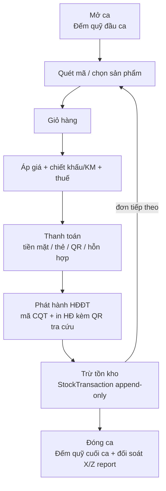
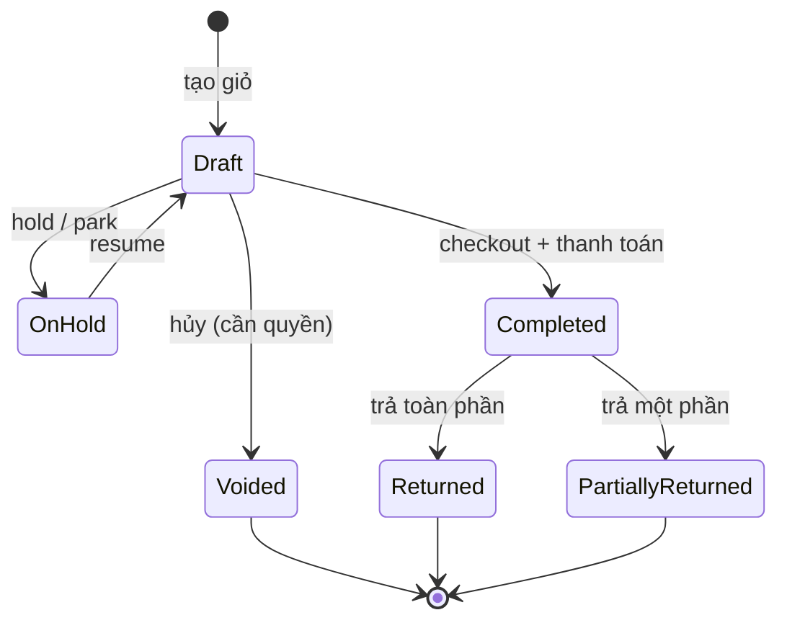
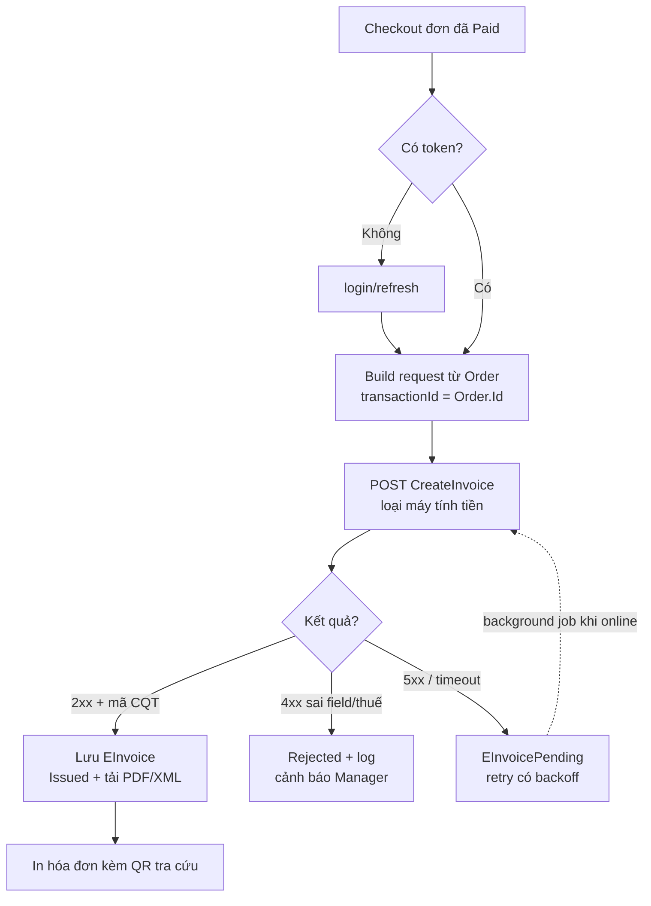
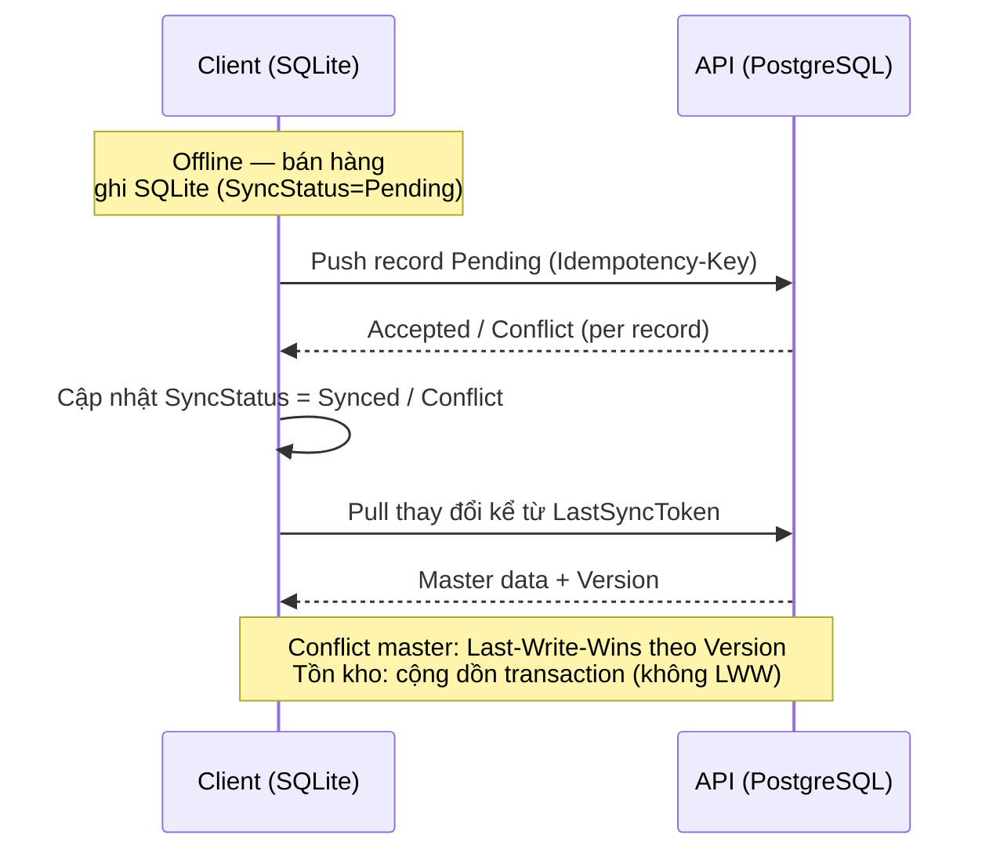

# Workflow.md — Sơ đồ luồng nghiệp vụ POS

Tổng hợp các luồng chính của hệ thống POS bán lẻ (offline-first, HĐĐT kết nối thuế).
Nguồn: [`BusinessRules.md`](./BusinessRules.md) (B1, B4, B11-A) và [`Technical.md`](./Technical.md) (§9 Sync).

---

## 1. Luồng bán lẻ tổng quát (happy path — B1)



---

## 2. Máy trạng thái đơn hàng (Order state machine — B4)



> Mỗi đơn phải gắn **1 Shift đang mở**. Đơn đã thanh toán/đã phát hành HĐĐT **không xóa cứng** —
> chỉ điều chỉnh/thay thế/hủy qua nghiệp vụ HĐĐT (B11) + AuditLog. Định danh nội bộ luôn là **GUID**.

---

## 3. Phát hành hóa đơn điện tử (EasyInvoice — B11-A.5)



> **Idempotency:** luôn gửi `transactionId = Order.Id`. Nghi đã gửi → `QueryAsync` lấy lại mã CQT,
> **không bao giờ tạo 2 HĐ cho 1 Order**. Offline: in **phiếu tạm tính** ("chưa phải hóa đơn"),
> đẩy vào hàng đợi `EInvoicePending`; chỉ hợp lệ khi có **mã CQT**.

---

## 4. Đồng bộ offline-first (Sync — Technical §9)



> Conflict không tự giải được → đánh dấu `Conflict`, hiển thị cho Manager xử lý tay.
```
